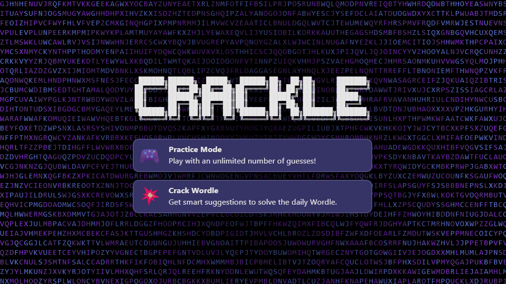
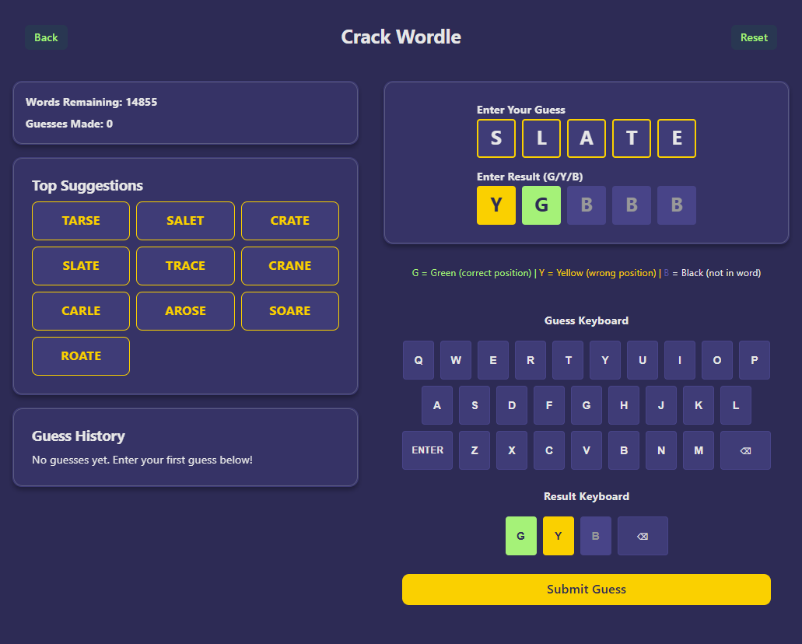
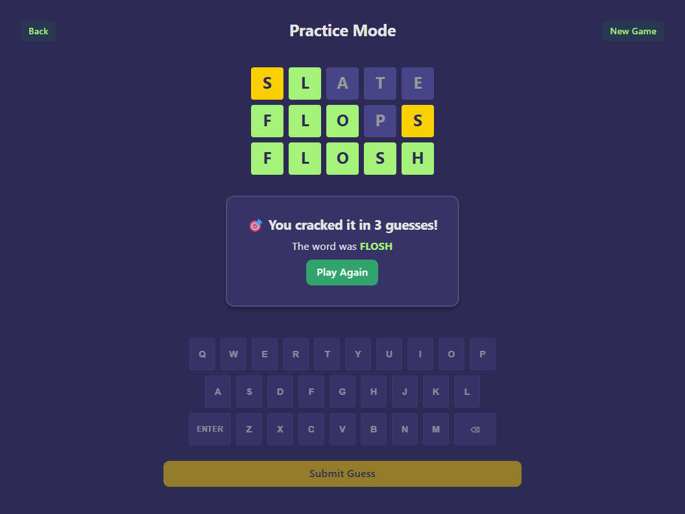

# Crackle

<a href="https://github.com/nicolasluckie/crackle/actions/workflows/ci.yml">
	
</a>

Practice or Crack the daily Wordle 💥



## Features

- **Practice Mode**: Play unlimited Wordle games with emoji feedback (🟩🟨⬛)
- **Crack Wordle Mode**: Get intelligent suggestions to solve the daily Wordle puzzle
- **Physical + On-screen Keyboards**: Type with your keyboard or click the on-screen buttons
- **Smart Context Switching**: Automatically switches between guess and result input
- **Smooth Scrolling**: Auto-scrolls to relevant sections (suggestions ↔ submit ↔ stats)
- **Dark Theme**: Beautiful "Shades of Purple" theme with animated backgrounds
- **Word List Caching**: Caches word list locally for faster subsequent loads (7-day expiration)
- **Loading States**: Visual feedback with animated spinners and loading messages
- **Responsive Design**: Works seamlessly on desktop and mobile devices
- **Real-time Filtering**: Instantly filters and ranks word suggestions
- **CLI Mode**: Original command-line interface still available





## Roadmap

- [x] 🐳 Production build & deployment using Docker
- [x] 🧪 Frontend unit tests
- [x] 🎨 Shades of Purple theme with animations
- [x] ⚛️ React + TypeScript web UI with Vite
- [x] 🧪 Backend unit tests using unittest + pytest
- [x] 🚀 Initial Python script with core functionality

## How It Works

A list of 14,801 valid 5-letter Wordle answers is loaded from `wordle_answers.txt`. Obtained from [dracos/valid-wordle-words.txt](https://gist.github.com/dracos/dd0668f281e685bad51479e5acaadb93).

You can then enter a guess and the corresponding results (g/y/b) to filter down the possible answers.

- **g** = (correct letter in the correct position)
- **y** = (correct letter, wrong position)
- **b** = (letter not in the word, removes all remaining words containing that letter)

There is no limit to the number of guesses you can enter.

Next-word suggestions are ranked by positional and global letter frequency and unique-letter coverage, with a light duplicate-letter penalty and a small vowel bonus when many candidates remain.

## Getting Started

### Prerequisites

**Development:**
- Node.js 18+ and npm
- Python 3.7+
- Flask and flask-cors (`pip install flask flask-cors`)

**Production (Docker):**
- Docker (v20.10+)
- Docker Compose (v2.0+)

### Installation

#### Development Setup

1. Install frontend dependencies:
```bash
cd web
npm install
```

2. Install backend dependencies (from the root directory):
```bash
pip install flask flask-cors
```

3. (Optional) Configure analytics in `web/.env.local`:
```bash
# Leave empty to disable analytics during development
VITE_ANALYTICS_URL=
VITE_ANALYTICS_WEBSITE_ID=
```

#### Production Setup (Docker)

1. Navigate to the docker directory:
```bash
cd docker
```

2. Configure environment (copy and edit `.env.production` to `.env`):
```bash
cp .env.production .env
# Edit .env to configure CORS and analytics (optional)
```

3. Build and start the application:
```bash
docker-compose up -d
```

4. Access the application at `http://localhost:8080`

See [`docker/README.md`](./docker/README.md) for detailed Docker deployment instructions.

### Running the Application

#### Development Mode

You need to run both the Flask API backend and the React frontend.

**Quick Start (Single Command)**

From the `web` directory:

```bash
npm start
```

This will start both the Flask API backend and React frontend concurrently.

- **API**: `http://localhost:5000`
- **Web Interface**: `http://localhost:5173`

**Manual Start (Separate Terminals)**

Alternatively, you can run them separately:

**Terminal 1: Start the Flask API**

From the root directory:

```bash
python api.py
```

The API will start on `http://localhost:5000`

**Terminal 2: Start the React Frontend**

From the `web` directory:

```bash
npm run dev
```

The web interface will start on `http://localhost:5173`

The web interface will start on `http://localhost:5173`

Open your browser and navigate to `http://localhost:5173` to use the application.

## Usage

### Practice Mode (Web UI)

1. Select "Practice Mode" from the main menu
2. Type your guess using the on-screen keyboard or your physical keyboard
3. Press Enter to submit
4. Get instant emoji feedback: 🟩 (correct position), 🟨 (wrong position), ⬛ (not in word)
5. Keep guessing until you find the word!
6. Click "New Game" to play again

### Practice Mode (CLI)

1. Run the play mode:
```
python crackle.py --play
```
2. Type your guess and press Enter
3. See emoji feedback: 🟩🟨⬛
4. Keep guessing until you find the word!

### Crack Wordle Mode (Web UI)

1. Select "Crack Wordle" from the main menu
2. Type your guess from the actual Wordle game
3. Type the result using G (green), Y (yellow), B (black) and press Enter
4. See the filtered words and top suggestions
5. Click on a suggestion to use it as your next guess
6. Repeat until you solve the puzzle!

### Crack Wordle Mode (CLI)

1. Run the crack mode:
```
python crackle.py --crack
```
2. Type your guess from the actual Wordle game
3. Type the result using G (green), Y (yellow), B (black) and press Enter
4. See the filtered words and top suggestions
5. Click on a suggestion to use it as your next guess

## Building for Production

```bash
npm run build
```

The built files will be in the `dist` directory.

## Technology Stack

### Frontend
- **Framework**: React 19 with TypeScript
- **Build Tool**: Vite 7
- **UI Library**: Radix UI Themes 3
- **HTTP Client**: Axios 1.12
- **Styling**: CSS with HSL color system
- **Testing**: Vitest 3, React Testing Library

### Backend
- **Language**: Python 3.9+
- **Framework**: Flask
- **CORS**: flask-cors

### Development Tools
- **Linting**: Ruff (Python), ESLint (TypeScript)
- **Type Checking**: mypy (Python), TypeScript
- **Testing**: pytest (Python), Vitest (Web)
- **Pre-commit Hooks**: Automated linting, formatting, and testing

## Testing

### Python CLI Tests

- Run everything (lint, type-checks, tests):

```
pre-commit run --all-files
```

- Just the unit tests:

```
pytest
```

### Web Interface Tests

The web interface includes comprehensive unit tests with Vitest and React Testing Library.

**Run Tests:**
```bash
cd web
npm test                # Run tests once
npm run test:watch      # Run tests in watch mode
npm run test:coverage   # Generate coverage report
```

**Test Structure:**

Tests are located in `web/src/test/` and include 37 tests covering:
- **MainMenu.test.tsx** (8 tests): Main menu navigation, word list caching, loading states, error handling
- **CrackMode.test.tsx** (17 tests): Crack Mode functionality, physical keyboard input, on-screen keyboard, guess/result validation, API integration, success/error states, suggestion clicking
- **wordListCache.test.ts** (12 tests): LocalStorage caching utility, cache expiration (7 days), version validation, error handling

**Coverage Goals:**
- Statements: > 80%
- Branches: > 75%
- Functions: > 80%
- Lines: > 80%

Additional testing examples, best practices, and debugging tips are available in [`web/src/test/README.md`](./web/src/test/README.md)

## Project Structure

```
crackle/
├── crackle.py                   # Python CLI implementation
├── api.py                       # Flask API backend
├── wordle_answers.txt           # 14,801 valid 5-letter words
├── tests/                       # Python tests
│   └── test_crackle.py
├── web/                         # React web interface
│   ├── src/
│   │   ├── components/
│   │   │   ├── MainMenu.tsx         # Main menu with mode selection
│   │   │   ├── MainMenu.css
│   │   │   ├── PracticeMode.tsx     # Practice mode game
│   │   │   ├── PracticeMode.css
│   │   │   ├── CrackMode.tsx        # Crack Wordle helper
│   │   │   ├── CrackMode.css
│   │   │   └── ReactBits/           # Animated components
│   │   │       ├── LetterGlitch.tsx # Animated background
│   │   │       ├── DecryptedText.tsx
│   │   │       └── ClickSpark.tsx
│   │   ├── utils/
│   │   │   └── wordListCache.ts     # LocalStorage caching utility
│   │   ├── test/                    # Unit tests (Vitest)
│   │   │   ├── setup.ts
│   │   │   ├── MainMenu.test.tsx
│   │   │   ├── CrackMode.test.tsx
│   │   │   └── wordListCache.test.ts
│   │   ├── App.tsx                  # Main app component
│   │   └── main.tsx                 # Entry point
│   ├── public/
│   ├── package.json
│   ├── vite.config.ts               # Vite configuration
│   └── vitest.config.ts             # Test configuration
├── .pre-commit-config.yaml          # Pre-commit hooks
└── .github/workflows/ci.yml         # GitHub Actions CI
```

## API Endpoints

The Flask backend (`api.py`) provides:

- `GET /api/health` - Health check
- `GET /api/words` - Get the full word list
- `POST /api/filter` - Filter words based on guess and result
- `POST /api/play/new` - Start a new practice game
- `POST /api/play/guess` - Submit a guess in practice mode

## License

Crackle is open-sourced software licensed under the [MIT license](./LICENSE).

## Privacy & Analytics

Crackle uses optional Umami Analytics for anonymous usage tracking (no cookies, GDPR-compliant). Analytics can be disabled via environment configuration. See [PRIVACY.md](./PRIVACY.md) for details.

---

> **Disclaimer:** _Crackle is not affiliated with, endorsed by, or connected to Wordle, The New York Times, or any official Wordle entities. This is an independent passion project created for educational and entertainment purposes._
